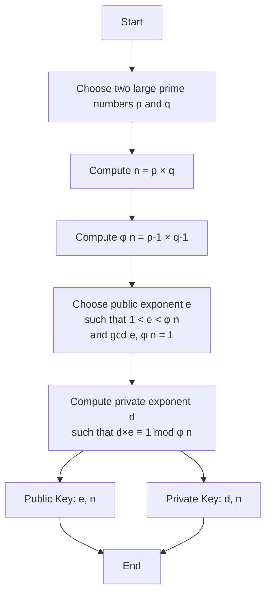

# RSA Encryption: Mathematical Foundations

RSA (Rivest–Shamir–Adleman) is one of the first public-key cryptosystems and is widely used for secure data transmission. In this lecture, we'll explore the mathematical foundations that make RSA possible.

<!--more-->

## Introduction

RSA encryption relies on the practical difficulty of factoring the product of two large prime numbers. The encryption and decryption operations are based on modular exponentiation, which is computationally efficient even for very large numbers.

## Mathematical Prerequisites

### Prime Numbers and Modular Arithmetic

A prime number $$p$$ is a natural number greater than 1 that has no positive divisors other than 1 and itself. In RSA, we work extensively with modular arithmetic, where we compute remainders after division.

For any integers $$a$$, $$b$$, and $$n$$, we say:

$$a \equiv b \pmod{n}$$

if $$n$$ divides $$(a - b)$$.

### Euler's Totient Function

Euler's totient function $$\phi(n)$$ counts the number of integers from 1 to $$n$$ that are coprime to $$n$$. For a prime $$p$$:

$$\phi(p) = p - 1$$

For the product of two distinct primes $$p$$ and $$q$$:

$$\phi(pq) = \phi(p) \cdot \phi(q) = (p-1)(q-1)$$

This property is fundamental to RSA.

## RSA Key Generation

The RSA key generation process follows these steps:



### Step-by-Step Algorithm

1. **Select primes**: Choose two distinct prime numbers $$p$$ and $$q$$
   - For security, $$p$$ and $$q$$ should be very large (typically 1024-2048 bits)
   - Keep $$p$$ and $$q$$ secret

2. **Compute modulus**: Calculate $$n = p \times q$$
   - $$n$$ is used as the modulus for both public and private keys
   - Its length in bits is the key length

3. **Compute totient**: Calculate $$\phi(n) = (p-1)(q-1)$$

4. **Choose public exponent**: Select $$e$$ such that:
   - $$1 < e < \phi(n)$$
   - $$\gcd(e, \phi(n)) = 1$$
   - Common choice: $$e = 65537$$ ($$2^{16} + 1$$)

5. **Compute private exponent**: Find $$d$$ such that:

   $$d \cdot e \equiv 1 \pmod{\phi(n)}$$

   This means $$d$$ is the modular multiplicative inverse of $$e$$ modulo $$\phi(n)$$.

## Encryption and Decryption

### Encryption

To encrypt a message $$M$$ (where $$0 \leq M < n$$) using the public key $$(e, n)$$:

$$C = M^e \bmod n$$

where $$C$$ is the ciphertext.

### Decryption

To decrypt the ciphertext $$C$$ using the private key $$(d, n)$$:

$$M = C^d \bmod n$$

### Why This Works

The correctness of RSA relies on Euler's theorem. Since $$d \cdot e \equiv 1 \pmod{\phi(n)}$$, we can write:

$$d \cdot e = 1 + k\phi(n)$$

for some integer $$k$$. Therefore:

$$C^d = (M^e)^d = M^{ed} = M^{1 + k\phi(n)} = M \cdot (M^{\phi(n)})^k \equiv M \cdot 1^k \equiv M \pmod{n}$$

## Concrete Example

Let's work through a small example (note: in practice, much larger numbers are used).

### Key Generation

1. Choose primes: $$p = 61$$, $$q = 53$$
2. Compute $$n = 61 \times 53 = 3233$$
3. Compute $$\phi(n) = 60 \times 52 = 3120$$
4. Choose $$e = 17$$ (since $$\gcd(17, 3120) = 1$$)
5. Compute $$d = 2753$$ (since $$17 \times 2753 \equiv 1 \pmod{3120}$$)

**Public key**: $$(e, n) = (17, 3233)$$
**Private key**: $$(d, n) = (2753, 3233)$$

### Encrypting the Message

Let's encrypt the message $$M = 123$$:

$$C = 123^{17} \bmod 3233 = 855$$

### Decrypting the Ciphertext

To decrypt $$C = 855$$:

$$M = 855^{2753} \bmod 3233 = 123$$

We successfully recovered the original message!

## Security Considerations

### Why is RSA Secure?

The security of RSA depends on the difficulty of factoring $$n$$ into its prime factors $$p$$ and $$q$$. While it's easy to:

- Multiply two large primes: $$O(\log^2 n)$$ time
- Compute $$\phi(n)$$ if you know $$p$$ and $$q$$

It's computationally infeasible to:

- Factor $$n$$ into $$p$$ and $$q$$: no known polynomial-time algorithm
- Compute $$\phi(n)$$ without knowing $$p$$ and $$q$$

### Key Sizes

| Key Size | Security Level | Quantum Resistance |
|----------|---------------|-------------------|
| 1024 bits | Legacy (weak) | No |
| 2048 bits | Standard | No |
| 3072 bits | High | No |
| 4096 bits | Very High | No |

{:.info}
**Note**: RSA is not quantum-resistant. Post-quantum cryptography research is developing alternatives.

## Common Attacks and Mitigations

### Small Exponent Attack

If $$e$$ is very small and $$M^e < n$$, then:

$$C = M^e$$

(no modular reduction occurs)

An attacker can simply compute the $$e$$-th root of $$C$$ to recover $$M$$.

**Mitigation**: Use proper padding (e.g., OAEP).

### Common Modulus Attack

If the same modulus $$n$$ is used with different exponents for different users, messages can be compromised.

**Mitigation**: Never reuse the same modulus for different key pairs.

### Timing Attacks

The time taken for modular exponentiation can leak information about the private key.

**Mitigation**: Use constant-time implementations and blinding techniques.

## Python Implementation

Here's a simple Python implementation (for educational purposes only - use established libraries in production):

```python
import random
from math import gcd

def is_prime(n, k=5):
    """Miller-Rabin primality test"""
    if n < 2:
        return False
    if n == 2 or n == 3:
        return True
    if n % 2 == 0:
        return False

    # Write n-1 as 2^r * d
    r, d = 0, n - 1
    while d % 2 == 0:
        r += 1
        d //= 2

    # Witness loop
    for _ in range(k):
        a = random.randrange(2, n - 1)
        x = pow(a, d, n)

        if x == 1 or x == n - 1:
            continue

        for _ in range(r - 1):
            x = pow(x, 2, n)
            if x == n - 1:
                break
        else:
            return False

    return True

def generate_prime(bits):
    """Generate a prime number with specified bit length"""
    while True:
        p = random.getrandbits(bits)
        if p % 2 == 0:
            p += 1
        if is_prime(p):
            return p

def extended_gcd(a, b):
    """Extended Euclidean Algorithm"""
    if a == 0:
        return b, 0, 1
    gcd_val, x1, y1 = extended_gcd(b % a, a)
    x = y1 - (b // a) * x1
    y = x1
    return gcd_val, x, y

def mod_inverse(e, phi):
    """Compute modular multiplicative inverse"""
    gcd_val, x, _ = extended_gcd(e, phi)
    if gcd_val != 1:
        raise ValueError("Modular inverse does not exist")
    return x % phi

def generate_keypair(bits=1024):
    """Generate RSA public and private key pair"""
    # Generate two distinct primes
    p = generate_prime(bits // 2)
    q = generate_prime(bits // 2)
    while p == q:
        q = generate_prime(bits // 2)

    # Compute n and phi(n)
    n = p * q
    phi = (p - 1) * (q - 1)

    # Choose e (commonly 65537)
    e = 65537
    if gcd(e, phi) != 1:
        # Fallback to finding suitable e
        e = 3
        while gcd(e, phi) != 1:
            e += 2

    # Compute d
    d = mod_inverse(e, phi)

    return ((e, n), (d, n))

def encrypt(message, public_key):
    """Encrypt message using public key"""
    e, n = public_key
    # Convert message to integer if it's a string
    if isinstance(message, str):
        message = int.from_bytes(message.encode(), 'big')
    return pow(message, e, n)

def decrypt(ciphertext, private_key):
    """Decrypt ciphertext using private key"""
    d, n = private_key
    message_int = pow(ciphertext, d, n)
    # Convert back to string
    byte_length = (message_int.bit_length() + 7) // 8
    return message_int.to_bytes(byte_length, 'big').decode()

# Example usage
if __name__ == "__main__":
    # Generate keys
    public, private = generate_keypair(512)  # Small for demonstration
    print(f"Public key: {public}")
    print(f"Private key: {private}")

    # Encrypt message
    message = "Hello RSA!"
    ciphertext = encrypt(message, public)
    print(f"\nOriginal message: {message}")
    print(f"Encrypted: {ciphertext}")

    # Decrypt message
    decrypted = decrypt(ciphertext, private)
    print(f"Decrypted: {decrypted}")
```

## Conclusion

RSA encryption demonstrates the elegant application of number theory to practical cryptography. While the mathematics is straightforward, the security relies on the computational difficulty of factoring large numbers—a problem that remains hard for classical computers but is vulnerable to quantum computers.

## Further Reading

- [Original RSA Paper (1978)](https://people.csail.mit.edu/rivest/Rsapaper.pdf)
- [NIST Special Publication 800-56B](https://csrc.nist.gov/publications/detail/sp/800-56b/rev-2/final): Recommendation for Pair-Wise Key-Establishment Using Integer Factorization Cryptography
- Dan Boneh's online cryptography course on Coursera

## Practice Problems

1. Generate an RSA key pair with $$p = 43$$ and $$q = 59$$. Choose $$e = 13$$ and compute $$d$$.
2. Using your generated keys, encrypt the message $$M = 100$$ and verify decryption.
3. Explain why choosing $$p$$ and $$q$$ close to each other is insecure.
4. Research and explain Wiener's attack on RSA with small private exponents.

---

*This article is part of the Spring 2026 Encryption course at Texas Tech University.*
