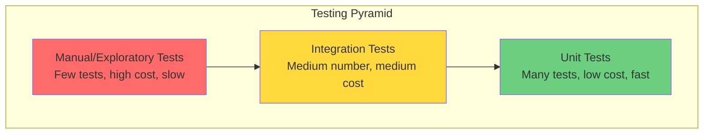
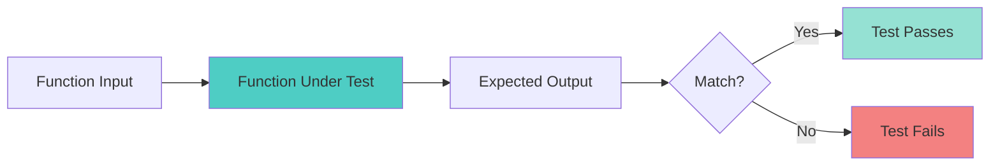
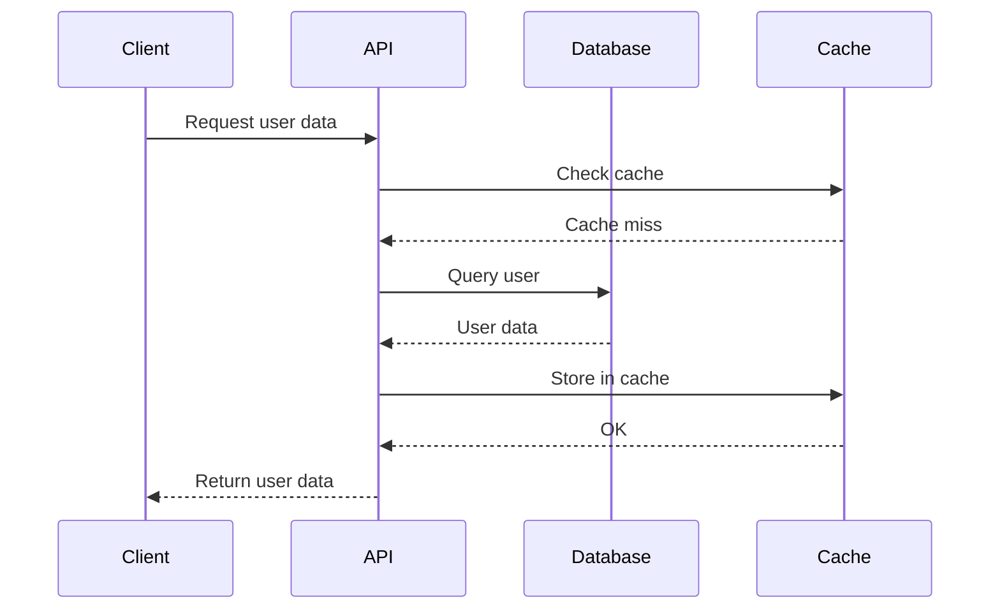
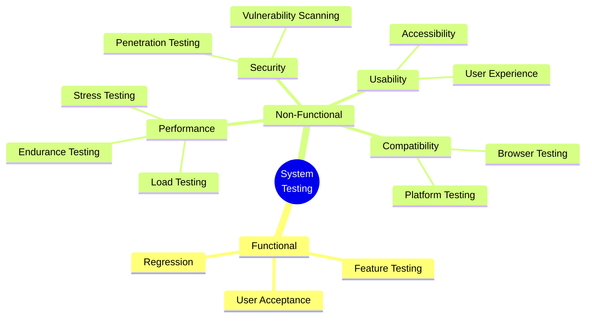
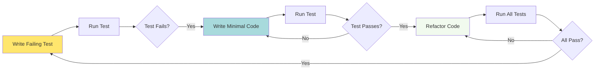
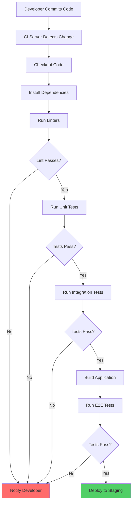

# Software Testing Strategies: From Unit to System Testing

Effective software testing requires a systematic approach that covers multiple levels of verification. In this lecture, we'll explore comprehensive testing strategies that ensure software quality from individual functions to complete systems.

<!--more-->

## Introduction

Software testing is not a single activity but a multi-layered process. Each level of testing serves a specific purpose and catches different types of defects. Understanding when and how to apply each testing strategy is crucial for building reliable software.

## The Testing Pyramid

The testing pyramid is a metaphor that illustrates the ideal distribution of different types of tests:



### Key Principles

1. **Many Unit Tests**: Fast, isolated, and inexpensive to maintain
2. **Fewer Integration Tests**: Verify component interactions
3. **Minimal E2E Tests**: Expensive but validate complete user flows

## Levels of Software Testing

### 1. Unit Testing

Unit testing verifies individual components or functions in isolation.



#### Best Practices

- **Test one thing**: Each test should verify a single behavior
- **Independence**: Tests shouldn't depend on each other
- **Fast execution**: Unit tests should run in milliseconds
- **Clear naming**: Test names should describe what they verify

#### Example: Testing a Calculator Function

```python
import unittest

class Calculator:
    @staticmethod
    def add(a, b):
        """Add two numbers"""
        return a + b

    @staticmethod
    def divide(a, b):
        """Divide a by b"""
        if b == 0:
            raise ValueError("Cannot divide by zero")
        return a / b

class TestCalculator(unittest.TestCase):
    def test_add_positive_numbers(self):
        """Test adding two positive numbers"""
        result = Calculator.add(3, 5)
        self.assertEqual(result, 8)

    def test_add_negative_numbers(self):
        """Test adding two negative numbers"""
        result = Calculator.add(-3, -5)
        self.assertEqual(result, -8)

    def test_divide_valid_numbers(self):
        """Test dividing two valid numbers"""
        result = Calculator.divide(10, 2)
        self.assertEqual(result, 5)

    def test_divide_by_zero_raises_error(self):
        """Test that dividing by zero raises ValueError"""
        with self.assertRaises(ValueError) as context:
            Calculator.divide(10, 0)
        self.assertEqual(str(context.exception), "Cannot divide by zero")

if __name__ == '__main__':
    unittest.main()
```

### 2. Integration Testing

Integration testing verifies that different modules or services work together correctly.



#### Integration Testing Strategies

1. **Big Bang**: Test all components together at once
   - Pros: Fast to set up
   - Cons: Hard to isolate defects

2. **Top-Down**: Start with high-level modules
   - Pros: Early prototype possible
   - Cons: Requires stubs for lower modules

3. **Bottom-Up**: Start with low-level modules
   - Pros: No stubs needed
   - Cons: Late system-level testing

4. **Sandwich**: Combine top-down and bottom-up
   - Pros: Parallel testing possible
   - Cons: More complex

### 3. System Testing

System testing validates the complete, integrated system against requirements.

#### Types of System Testing



## Test Coverage Analysis

Test coverage measures how much of your code is executed during testing. Here's a comparison of different coverage metrics:

```chart
{
  "type": "bar",
  "data": {
    "labels": ["Statement Coverage", "Branch Coverage", "Function Coverage", "Line Coverage", "Condition Coverage"],
    "datasets": [{
      "label": "Current Project Coverage (%)",
      "data": [85, 72, 90, 88, 65],
      "backgroundColor": [
        "rgba(54, 162, 235, 0.8)",
        "rgba(255, 206, 86, 0.8)",
        "rgba(75, 192, 192, 0.8)",
        "rgba(153, 102, 255, 0.8)",
        "rgba(255, 159, 64, 0.8)"
      ],
      "borderColor": [
        "rgba(54, 162, 235, 1)",
        "rgba(255, 206, 86, 1)",
        "rgba(75, 192, 192, 1)",
        "rgba(153, 102, 255, 1)",
        "rgba(255, 159, 64, 1)"
      ],
      "borderWidth": 2
    }]
  },
  "options": {
    "responsive": true,
    "scales": {
      "y": {
        "beginAtZero": true,
        "max": 100,
        "ticks": {
          "callback": "function(value) { return value + '%'; }"
        }
      }
    },
    "plugins": {
      "title": {
        "display": true,
        "text": "Test Coverage Metrics - Spring 2026 Project"
      },
      "legend": {
        "display": false
      }
    }
  }
}
```

### Coverage Metrics Explained

| Metric | Description | Target |
|--------|-------------|--------|
| **Statement Coverage** | % of statements executed | ≥ 80% |
| **Branch Coverage** | % of decision branches taken | ≥ 70% |
| **Function Coverage** | % of functions called | ≥ 85% |
| **Line Coverage** | % of lines executed | ≥ 80% |
| **Condition Coverage** | % of boolean conditions evaluated | ≥ 60% |

{:.warning}
**Important**: High coverage doesn't guarantee quality. It only shows what code was executed, not whether it was tested correctly.

## The Test-Driven Development (TDD) Workflow

TDD is a software development approach where you write tests before writing code:



### TDD Benefits

1. **Better Design**: Writing tests first forces you to think about interfaces
2. **Documentation**: Tests serve as executable documentation
3. **Confidence**: Comprehensive test suite enables safe refactoring
4. **Less Debugging**: Catch bugs early when they're easiest to fix

## Continuous Integration Testing

Modern software development integrates testing into the CI/CD pipeline:



## Defect Detection Rates by Testing Phase

Understanding when defects are typically found helps optimize testing strategy:

```chart
{
  "type": "line",
  "data": {
    "labels": ["Unit Testing", "Integration Testing", "System Testing", "Acceptance Testing", "Production"],
    "datasets": [
      {
        "label": "Defects Found",
        "data": [45, 30, 18, 5, 2],
        "borderColor": "rgb(255, 99, 132)",
        "backgroundColor": "rgba(255, 99, 132, 0.2)",
        "tension": 0.4,
        "fill": true
      },
      {
        "label": "Cost to Fix (Relative)",
        "data": [1, 5, 10, 20, 100],
        "borderColor": "rgb(54, 162, 235)",
        "backgroundColor": "rgba(54, 162, 235, 0.2)",
        "tension": 0.4,
        "fill": true
      }
    ]
  },
  "options": {
    "responsive": true,
    "plugins": {
      "title": {
        "display": true,
        "text": "Defects Found vs. Cost to Fix by Testing Phase"
      },
      "legend": {
        "display": true,
        "position": "top"
      }
    },
    "scales": {
      "y": {
        "beginAtZero": true,
        "title": {
          "display": true,
          "text": "Percentage / Relative Cost"
        }
      },
      "x": {
        "title": {
          "display": true,
          "text": "Testing Phase"
        }
      }
    }
  }
}
```

### Key Insights

1. **Most defects** are found during unit and integration testing
2. **Cost increases exponentially** the later a defect is discovered
3. **Invest in early testing** to reduce overall costs
4. **Production defects** are 100x more expensive to fix than unit test defects

## Test Automation Strategies

### When to Automate

Automate tests that are:
- Repetitive and time-consuming
- Prone to human error
- Need to run frequently
- Provide high ROI

### When NOT to Automate

Don't automate tests that are:
- One-time or rarely executed
- Constantly changing (unstable requirements)
- Require human judgment (UI/UX evaluation)
- Too expensive to maintain

## Best Practices Checklist

- [ ] Write tests before fixing bugs (bug reproduction test)
- [ ] Maintain test independence (no shared state)
- [ ] Use descriptive test names (test_method_condition_expected_result)
- [ ] Follow the AAA pattern (Arrange, Act, Assert)
- [ ] Keep tests focused (one logical assertion per test)
- [ ] Use test fixtures and mocks appropriately
- [ ] Run tests frequently (on every commit)
- [ ] Monitor and maintain test coverage
- [ ] Review and refactor tests regularly
- [ ] Document complex test scenarios

## Common Testing Pitfalls

1. **Testing implementation instead of behavior**
   - Bad: Testing internal implementation details
   - Good: Testing observable behavior and outputs

2. **Neglecting edge cases**
   - Always test: null values, empty inputs, boundary conditions

3. **Flaky tests**
   - Tests that sometimes pass and sometimes fail
   - Usually caused by timing issues, shared state, or external dependencies

4. **Over-mocking**
   - Too many mocks can make tests brittle and less valuable

## Conclusion

Effective software testing is a multi-layered approach that combines different testing strategies at various levels. By following the testing pyramid, practicing TDD, and integrating tests into your CI/CD pipeline, you can build more reliable and maintainable software.

Remember: **The goal of testing is not to prove that software works, but to find where it doesn't.**

## Lab Exercise

Build a simple REST API for a todo list application and implement:

1. Unit tests for business logic (50% of grade)
2. Integration tests for API endpoints (30% of grade)
3. End-to-end tests for complete user workflows (20% of grade)

Requirements:
- Minimum 80% code coverage
- All tests must pass in CI pipeline
- Follow TDD approach
- Document test strategy

**Due Date**: February 15, 2026

## Additional Resources

- [Martin Fowler's Testing Strategies](https://martinfowler.com/testing/)
- [Google Testing Blog](https://testing.googleblog.com/)
- Kent Beck's "Test Driven Development: By Example"
- [The Practical Test Pyramid](https://martinfowler.com/articles/practical-test-pyramid.html)

---

*This article is part of the Spring 2026 Software Verification & Validation course at Texas Tech University.*
